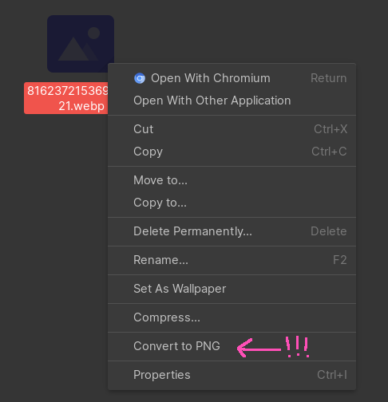

# nautilus-png-convert

A right-click context menu for Nautilus to convert images to PNG via ImageMagick.



## Alternatives

If you don't want to use this extension, you can simply use ImageMagick terminal commands:

```shell
$ # Convert a single file:
$ magick my_file.webp my_file.png
```

```shell
$ # Or if you want to do lots of files at once:
$ magick mogrify -format PNG *.webp
```

## Building

```shell
$ meson setup build .
$ meson compile -C build
$
$ # Install to system's nautilus extensions dir:
$ meson install -C build
```
